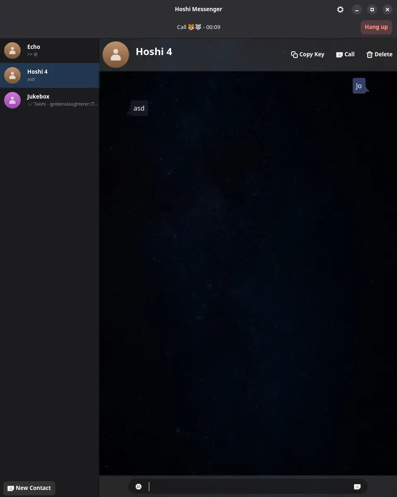

# Hoshi

Monorepo of the Hoshi messenger.

Still in early development so I'm not running a production server just yet.



## Development prerequisites

Right now every part of Hoshi is written in Rust, so you need a recent toolchain
which you can install via `rustup` for example. Additionally the client is built
with `gtk-rs` and `libadwaita` so you need those native dependencies installed.

### NixOS

On NixOS you can just use the included development flake, or enable direnv which
automatically switches to a dev shell.

```bash
nix develop
```

### Arch Linux

On Arch I'd recommend using `rustup` to install a stable toolchain and then installing
the native GTK dependencies

```bash
sudo pacman -S libadwaita gtk4 base-devel
```

### Fedora

You can install all the required dependencies using the following command:

```bash
sudo dnf install -y git rustup clang pkg-config \
  gtk4-devel libadwaita-devel \
  libX11-devel libxcb-devel libxkbcommon-devel libXcursor-devel \
  libXi-devel libXrandr-devel libXinerama-devel libXxf86vm-devel \
  mesa-libGL-devel mesa-libEGL-devel \
  vulkan-headers vulkan-loader-devel \
  alsa-lib-devel fontconfig-devel
```

Now you can ensure a stable Rust toolchain via:

```bash
rustup default stable
```

## Development

### Relay

To do development you must ensure that a relay is running on your machine so
that clients/bots can connect to it (debug builds try to connect to a relay
at `wss://127.0.0.1:2800/`). So for example start one terminal, `cd` to the
repo and then run:

```bash
cargo run --bin hoshi-relay
```

### Client

To start the GTK4 client run the following:

```bash
cargo run --bin hoshi-client-gtk
```

### Echo Bot

Now if you want to test voice calls you can use the Echo bot, when you send
it text messages it just sends you the same message back, additionally you can
call it and it picks up the phone and plays it back to you (I highly recommend
headphones for this, there's no echo cancellation yet!):

```bash
cargo run --bin hoshi-bot-echo
```

### Jukebox Bot

In order to communicate with one of those bots you need to add them as a contact
in your client, just press the `New Contact` button in the bottom left and
paste the public key of the bot (it'll print a key onto stdout on startup).

Another bot you might give a try is the Jukebox Bot, whenever you call it it
randomly accepts the call and plays back an mp3/m4a from `~/Music/`, mainly
helps to test audio quality and stutter free playback during various operations.

```bash
cargo run --bin hoshi-bot-jukebox
```

### Second client

Additionally you can try running a second client on your dev machine, for this
to work properly you need to start the second client with another profile, to
do so you run the following command:

```bash
cargo run --bin hoshi-client-gtk -- --data-dir ~/.hoshi2/
```

Release builds point to a Hetzner VM of mine, but right now I don't have the
Relay running regularly yet, as soon as I get around to getting the control
plane working I'll make sure to keep it running so that testing becomes easier.

## Community

Until Hoshi becomes self-hosting there is a [Discord channel](https://discord.gg/GSzAyF9NSA) you can join.


## ToDo / Next Steps

- [ ] Allow control plane to sign relay / client certs
- [ ] Check whether relay / client cert was signed by control plane
- [ ] Spaces / Group Chats

## Backlog

- [ ] SpaceDirectory bot
- [ ] Voice channels in spaces
- [ ] Rooms in spaces
- [ ] Shard message type
- [ ] Add some clientlib unit tests
- [ ] Add some relay unit tests
- [ ] Add integration tests between clientlib <-> relay

## Polish
Those aren't that important since it's just a prototype, but if there's time might implement
a couple of them since they shouldn't take too long

- [ ] UserDirectory bot
- [ ] Show arrows in chat bubbles only if they're the last (look at Telegram)
- [ ] Add timestamps before messages
- [ ] Add timestamps only if there's a pause of more than 5 minutes between messages
- [ ] Add an Application Icon
- [ ] Add right/long click context menu to contacts, should show Edit/Delete options
- [ ] Contact status indicators
- [ ] Show relay metrics on the landing page and send it via JSON
- [ ] Build public global relay dashboard

## Long-term polish
Those are more complicated non-essential tasks, will probably take a while until we get to them

- [ ] Build custom Emoji chooser, make it look nice on bare X11
- [ ] Typing indicator

## Completed

- [X] Show last message instead of public key, in the chat view show status 
- [X] Add arrows to chat bubbles
- [X] Notify and sync instead of sending messages directly, on startup notify all contacts
- [X] Audio calls, start with a Ring message, the other party may then send back an Accept/Reject message directly, once the call is open just spam the other side with regular G711 u-Law sample data and output it with rodio or something like that
- [X] Abstract audio interface, shouldn't have Rodio in clientlib
- [X] Make the clientlib reconnection logic more robust
- [X] Simple bots (Echo / Jukebox)
- [X] Work on the merkle-tree based sync with gossip support
- [X] Allow / Show messages from unknown people, change titleline so that instead of edit/delete we have add/block

## License

Unless otherwise stated all source code in this repository is under the MPL 2.0 license, see `/LICENSE`
